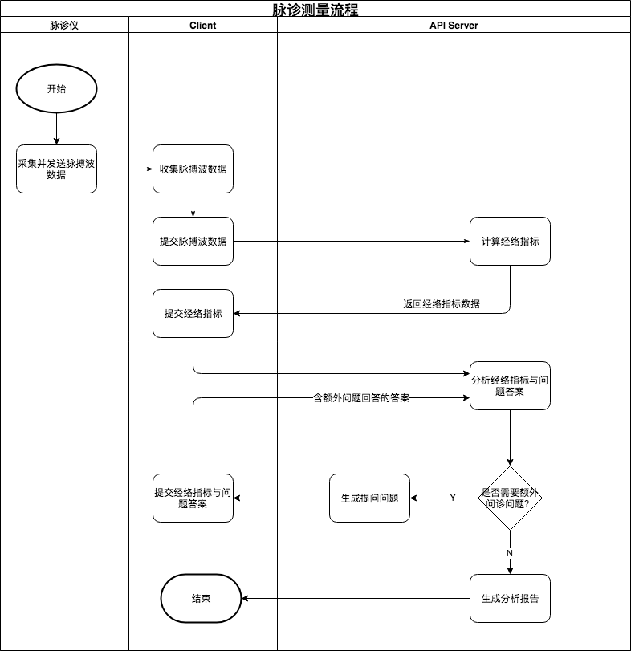

## 脉诊测量分析流程

## 1 总体流程图



**主要相关API接口：**

1. **测量API：**`POST /measurements`
2. **智能分析API：** `POST /measurements/{record_id}/analyze`

### 2 接口使用说明

#### 2.1 测量API

本接口的作用是将脉诊仪采集到的数据提交到API Server进行计算，返回流水号(`cid`)、经络指标、心率等数据。

具体数据字段定义参见API文档。

#### 2.2 智能分析API

智能分析API是一个会话问答式的API。

1. 首次提交智能分析API请求：

    ```json
    // First request
    {
        "cid": 123456,
        "analysis_session": null,
        "answer": []
    }
    ```

需要提供有测量接口返回的`cid`，`analysis_session`与`answer`字段传入初始空值，如上所示。

2. 如果问答过程需要回答问题，则API Server返回如下结果形式：

   ```json
   {
       "ok": true,
       "data": {
           "cid": 123456,
           "analysis_session": "xUJ4RqL27L79+THM3RQA=7f#$+o?3%m+",
           "analysis_done": false,
           "questionnaire": {
               "title": "Q123456",
               "questions": [{
                   "key": "Q.12.45.A",
                   "title": "问题1",
                   "description": "问题1 DDDDDDDD",
                   "tip": "XXXXXX",
                   "type": "multiple_choice",
                   "choices": [{
                           "key": "Q.12.35.A-C1",
                           "name": "A",
                           "value": "A"
                       },
                       {
                           "key": "Q.12.35.A-C2",
                           "name": "B",
                           "value": "B",
                           "conflict_keys": ["Q.12.35.A-C1"]
                       },
                       {
                           "key": "Q.12.35.A-C3",
                           "name": "C",
                           "value": "C"
                       }
                   ],
                   "default_keys": [
                       "A"
                   ]
               }],
               "answers": [{
                   "question_key": "Q.12.45.A",
                   "values": [
                       "A", "C"
                   ]
               }],
               "create_at": "2018-07-04T11:13:57Z"
           },
           "analysis_report": null
       }
   }
   ```

   

3. 如果问答过程结束，则API Server返回如下结果形式：

    ```json
    {
        "ok": true,
        "data": {
            "cid": 123456,
            "analysis_session": "xUJ4RqL27L79+THM3RQA=7f#$+o?3%m+",
            "analysis_done": true,
            "questionnaire": {
                "title": "Q123456",
                "questions": [{
                    "key": "Q.12.45.A",
                    "title": "问题1",
                    "description": "问题1 DDDDDDDD",
                    "tip": "XXXXXX",
                    "type": "multiple_choice",
                    "choices": [{
                            "key": "Q.12.35.A-C1",
                            "name": "A",
                            "value": "A"
                        },
                        {
                            "key": "Q.12.35.A-C2",
                            "name": "B",
                            "value": "B",
                            "conflict_keys": ["Q.12.35.A-C1"]
                        },
                        {
                            "key": "Q.12.35.A-C3",
                            "name": "C",
                            "value": "C"
                        }
                    ],
                    "default_keys": [
                        "A"
                    ]
                }],
                "answers": [{
                    "question_key": "Q.12.45.A",
                    "values": [
                        "A", "C"
                    ]
                }],
                "create_at": "2018-07-04T11:13:57Z"
            },
            "analysis_report": {
                "report_version": "1.0",
                "report_id": "20180703T1010124124",
                "content": {
                    "lead": [{
                        "key": "LEAD.001",
                        "label": "重要提示",
                        "content": "something"
                    }],
                    "user_profile": {},
                    "measurement_result": {
                        "finger": 4,
                        "c0": 3,
                        "c1": 3,
                        "c2": 3,
                        "c3": 3,
                        "c4": 3,
                        "c5": 3,
                        "c6": 3,
                        "c7": -2,
                        "heart_rate": 70,
                        "app_heart_rate": 68,
                        "partial_pulse_wave": []
                    },
                    "tags": [{
                        "key": "F.01-05",
                        "label": "XXXX",
                        "content": "something"
                    }],
                    "tips_for_woman": [{
                        "key": "T10101",
                        "label": "",
                        "content": "xxxxxxx"
                    }],
                    "channels_and_collaterals_explains": [{
                            "key": "CC.01.123123",
                            "label": "心包经",
                            "content": "心包经<strong>心包经<strong>心包经心包经"
                        },
                        {
                            "key": "CC.02.123123",
                            "label": "肝经",
                            "content": "肝经<strong>肝经<strong>肝经肝经"
                        }
                    ],
                    "constitution_differentiation_explains": [{
                        "key": "CD.010.1",
                        "label": "阳虚质（脉沉迟）",
                        "content": "阳虚质（脉沉迟）xxxxxxxxxxx"
                    }],
                    "syndrome_differentiation_explains": [{
                        "key": "SD.010.1",
                        "label": "寒湿困脾）",
                        "content": "寒湿困脾）xxxxxxxxxxx"
                    }]
                }
            }
        }
    }
    ```

