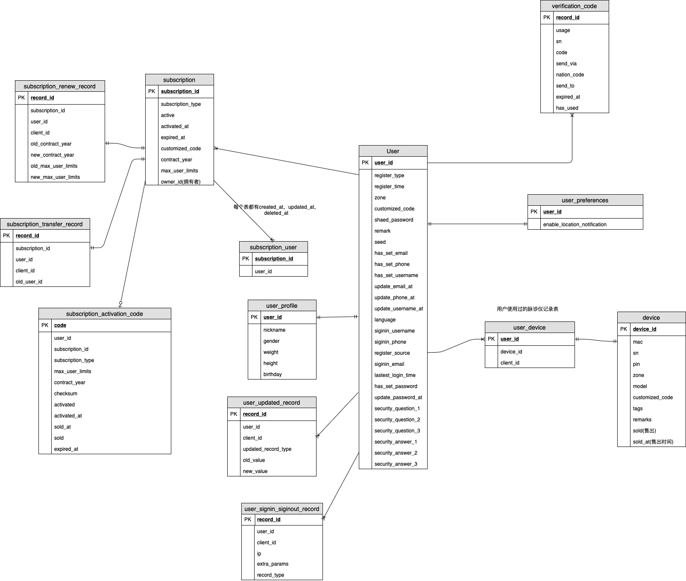

# 后端技术文档

##  数据库详细设计以及迁移方案
### 数据库E-R图



### 数据库迁移脚本

```mysql
-- 金姆ID迁移表

SET NAMES utf8mb4;
SET FOREIGN_KEY_CHECKS = 0;
-- ----------------------------
-- Table structure for user_profile 用户详情表
-- ----------------------------
DROP TABLE IF EXISTS `user_profile`;
CREATE TABLE `user_profile` (
    `user_id` INT(10) NOT NULL COMMENT '用户ID',
    `nickname` VARCHAR(255) NOT NULL DEFAULT '' COMMENT '用户昵称',
    `gender` ENUM('M', 'F') NOT NULL DEFAULT 'M' COMMENT '用户性别 M 男 F 女',
    `birthday` DATE NOT NULL COMMENT '用户生日',
    `height` SMALLINT(6) NOT NULL DEFAULT '0' COMMENT '用户身高 单位厘米',
    `weight` SMALLINT(6) NOT NULL DEFAULT '0' COMMENT '用户体重 单位千克',
    `created_at` TIMESTAMP NOT NULL COMMENT '数据记录创建时间',
    `updated_at` TIMESTAMP NOT NULL COMMENT '数据记录更新时间',
    `deleted_at` TIMESTAMP NULL DEFAULT NULL COMMENT '数据记录伪删除时间',
    PRIMARY KEY (`user_id`)
)  ENGINE=INNODB DEFAULT CHARSET=UTF8 COMMENT='用户档案';

-- ----------------------------
-- Table structure for audit_user_credential_update 用户审计记录表
-- ----------------------------
DROP TABLE IF EXISTS `audit_user_credential_update`;
CREATE TABLE `audit_user_credential_update` ( 
    `record_id` INT(10) UNSIGNED NOT NULL AUTO_INCREMENT COMMENT '记录ID',
    `user_id` INT(10) NOT NULL COMMENT '用户ID',
    `client_id` VARCHAR(255) NOT NULL COMMENT '客户端ID',
    `updated_record_type` ENUM('username', 'phone', 'email','password') NOT NULL DEFAULT 'email' COMMENT '更新记录的类型',
    `old_value` VARCHAR(255) NOT NULL COMMENT '旧的数值',
    `new_value` VARCHAR(255) NOT NULL COMMENT '新的数值',
    `created_at` TIMESTAMP NOT NULL COMMENT '数据记录创建时间',
    `updated_at` TIMESTAMP NOT NULL COMMENT '数据记录更新时间',
    `deleted_at` TIMESTAMP NULL DEFAULT NULL COMMENT '数据记录伪删除时间',
    PRIMARY KEY (`record_id`),
    KEY `idx_user_id` (`user_id`) USING BTREE
)  ENGINE=INNODB DEFAULT CHARSET=UTF8 COMMENT='用户审计记录';

-- ----------------------------
-- Table structure for audit_user_signin_signout 用户登录/登出记录表
-- ----------------------------
DROP TABLE IF EXISTS `audit_user_signin_signout`;
CREATE TABLE `audit_user_signin_signout` (
    `record_id` INT(10) UNSIGNED NOT NULL AUTO_INCREMENT COMMENT '记录ID',
    `user_id` INT(10) NOT NULL COMMENT '用户ID',
    `client_id` VARCHAR(255) NOT NULL COMMENT '客户端ID',
    `ip` VARCHAR(20) NOT NULL COMMENT 'ip地址',
    `extra_params` VARCHAR(255) NOT NULL COMMENT '登录/登出参数',
    `record_type` ENUM('signin', 'signout') NOT NULL DEFAULT 'signin' COMMENT '登录或登出记录的类型',
    `sign_in_machine` VARCHAR(255) NOT NULL COMMENT '登录机器',
    `created_at` TIMESTAMP NOT NULL COMMENT '数据记录创建时间',
    `updated_at` TIMESTAMP NOT NULL COMMENT '数据记录更新时间',
    `deleted_at` TIMESTAMP NULL DEFAULT NULL COMMENT '数据记录伪删除时间',
    PRIMARY KEY (`record_id`),
    KEY `idx_user_id` (`user_id`) USING BTREE
)  ENGINE=INNODB DEFAULT CHARSET=UTF8 COMMENT='用户登录/登出记录';

--  添加 enable_location_notification
ALTER table user_preferences ADD COLUMN enable_location_notification tinyint(4) NOT NULL DEFAULT 1 COMMENT '是否开启本地通知' AFTER `enable_health_trending`;

ALTER TABLE user RENAME legacy_user;

-- ----------------------------
-- Table structure for user 用户表
-- ----------------------------
DROP TABLE IF EXISTS `user`;
CREATE TABLE `user` (
    `user_id` INT(10) UNSIGNED NOT NULL AUTO_INCREMENT COMMENT '用户ID',
    `register_type` VARCHAR(20) NOT NULL COMMENT '用户注册方式',
    `register_time` TIMESTAMP NOT NULL COMMENT '注册时间',
    `zone` VARCHAR(255) NOT NULL COMMENT '用户选择的区域',
    `customized_code` VARCHAR(255) NOT NULL DEFAULT '' COMMENT '定制化代码',
    `remark` VARCHAR(255)CHARACTER SET UTF8MB4 COLLATE UTF8MB4_GENERAL_CI NOT NULL DEFAULT '' COMMENT '用户备注',
    `encrypted_password` VARCHAR(255) NOT NULL COMMENT '用户encrypt后的登录密码',
    `seed` VARCHAR(20) NOT NULL COMMENT '随机种子',
    `secure_email` VARCHAR(50) NOT NULL DEFAULT '' COMMENT '安全邮箱',
    `signin_phone` VARCHAR(50) NOT NULL DEFAULT '' COMMENT '登录Phone',
    `signin_username` VARCHAR(50) NOT NULL DEFAULT '' COMMENT '登录用户名',
    `nation_code` VARCHAR(50) NOT NULL COMMENT '国家代码',
    `language` VARCHAR(50) NOT NULL DEFAULT 'zh-Hans' COMMENT '语言',
    `has_set_email` TINYINT(4) NOT NULL COMMENT '是否设置邮箱',
    `has_set_phone` TINYINT(4) NOT NULL COMMENT '是否设置电话',
    `has_set_username` TINYINT(4) NOT NULL COMMENT '是否设置用户',
    `has_set_password` TINYINT(4) NOT NULL COMMENT '是否设置密码',
    `has_set_user_profile` TINYINT(4) NOT NULL COMMENT '是否设置用户详情',
    `has_set_secure_questions` TINYINT(4) NOT NULL COMMENT '是否设置密保问题',
    `has_set_language` TINYINT(4) NOT NULL COMMENT '是否设置语言',
    `register_source` VARCHAR(20) NOT NULL COMMENT '用户来源',
    `latest_login_time` TIMESTAMP  COMMENT '最近登录时间',
    `secure_question_1` VARCHAR(255)  COMMENT '密保问题1',
    `secure_question_2` VARCHAR(255)  COMMENT '密保问题2',
    `secure_question_3` VARCHAR(255)  COMMENT '密保问题3',
    `secure_answer_1` VARCHAR(255)  COMMENT '密保答案1',
    `secure_answer_2` VARCHAR(255)  COMMENT '密保答案2',
    `secure_answer_3` VARCHAR(255)  COMMENT '密保答案3',
    `latest_updated_email_at` TIMESTAMP NULL DEFAULT NULL COMMENT '最新更新邮箱的时间',
    `latest_updated_phone_at` TIMESTAMP NULL DEFAULT NULL COMMENT '最新更新电话的时间',
    `latest_updated_username_at` TIMESTAMP NULL DEFAULT NULL COMMENT '最新更新用户名的时间',
    `latest_updated_password_at` TIMESTAMP NULL DEFAULT NULL COMMENT '最新更新密码的时间',
    `latest_updated_secure_questions_at` TIMESTAMP NULL DEFAULT NULL COMMENT '最新更新密保问题的时间',
    `region` VARCHAR(255) DEFAULT 'mainland_china' COMMENT '区域',
    `has_set_region` TINYINT(4) NOT NULL COMMENT '是否设置区域',
    `created_at` TIMESTAMP NOT NULL COMMENT '数据记录创建时间',
    `updated_at` TIMESTAMP NOT NULL COMMENT '数据记录更新时间',
    `deleted_at` TIMESTAMP NULL DEFAULT NULL COMMENT '数据记录伪删除时间',
    PRIMARY KEY (`user_id`),
    KEY `idx_signin_username` (`signin_username`) USING BTREE,
    KEY `idx_secure_email` (`secure_email`) USING BTREE,
    KEY `idx_signin_phone` (`signin_phone`) USING BTREE
)  ENGINE=INNODB DEFAULT CHARSET=UTF8 COMMENT='用户登录/登出记录';

SET @now = NOW( );

-- 初始化用户数据
INSERT INTO `user` (
    `user_id`,
    `register_type`,
    `register_time`,
    `zone`,
    `customized_code`,
    `remark`,
    `seed`,
    `encrypted_password`,
    `secure_email`,
    `signin_phone`,
    `signin_username`,
    `nation_code`,
    `has_set_email`,
    `has_set_phone`,
    `has_set_username`,
    `has_set_password`,
    `has_set_user_profile`,
    `language`,
    `register_source`,
    `latest_login_time`,
    `secure_question_1`, 
    `secure_question_2`,
    `secure_question_3`,
    `secure_answer_1`,
    `secure_answer_2`,
    `secure_answer_3`,
    `latest_updated_email_at`, 
    `latest_updated_phone_at`,
    `latest_updated_username_at`,
    `latest_updated_password_at`, 
    `created_at`,
	`updated_at`,
	`deleted_at`
) SELECT
    LU.user_id,
    LU.register_type,
    LU.register_time,
    LU.zone,
    LU.customized_code,
    LU.remark,
    substring(MD5(RAND()),1,4) as seed,
    null as encrypted_password,
    LU.email,
    LU.phone,
    LU.username,
    '' as nation_code,
	CASE
			WHEN LU.email <> '' THEN 1 
			ELSE 0 
	END AS has_set_email,
	CASE
			WHEN LU.phone <> '' THEN 1
			ELSE 0 
	END AS has_set_phone,
	CASE
			WHEN LU.username <> '' THEN 1
			ELSE 0 
	END AS has_set_username,
	CASE
			WHEN LU.password <> '' THEN 1
			ELSE 0 
	END AS has_set_password,
    LU.is_profile_completed AS has_set_user_profile,
    'zh-Hans' AS language,
    '数据库迁移' AS register_source, 
    NULL AS  latest_login_time,
    NULL AS  secure_question_1,
    NULL AS  secure_question_2, 
    NULL AS  secure_question_3,
    NULL AS  secure_answer_1,
    NULL AS  secure_answer_2, 
    NULL AS  secure_answer_3,
    NULL AS  latest_updated_email_at,
    NULL AS  latest_updated_phone_at, 
    NULL AS  latest_updated_username_at, 
    NULL AS  latest_updated_password_at,
    @now AS created_at,
	@now AS updated_at,
	NULL AS deleted_at                                
FROM
	legacy_user AS LU
WHERE        
	LU.deleted_at IS NULL;   


-- 初始化用户详情数据
INSERT INTO `user_profile` (
    `user_id`,
    `nickname`,
    `gender`,
    `birthday`,
    `height`,
    `weight`,
    `created_at`,
    `updated_at`,
    `deleted_at`
) SELECT
    LU.user_id,
    LU.nickname,
    LU.gender,
    LU.birthday,
    LU.height,
    LU.weight,
    @now AS created_at,
	@now AS updated_at,
	NULL AS deleted_at                                
FROM
	legacy_user AS LU
WHERE        
	LU.deleted_at IS NULL;

-- 初始化 verification_code 数据 手机或邮箱验证表
DROP TABLE IF EXISTS `verification_code`;
CREATE TABLE `verification_code` (
    `record_id` int(10) unsigned NOT NULL AUTO_INCREMENT COMMENT '记录ID',
    `usage` VARCHAR(20) DEFAULT '' NOT NULL COMMENT '使用用途',
    `sn` VARCHAR(50)   DEFAULT '' COMMENT '序列号',
    `code` VARCHAR(6)   DEFAULT '' COMMENT '验证码',
    `send_via` ENUM('phone', 'email') NOT NULL DEFAULT 'phone' COMMENT '发送方式',
    `nation_code` VARCHAR(50) NOT NULL COMMENT '国家代码',
    `send_to` VARCHAR(255) DEFAULT '' NOT NULL COMMENT '接收人',
    `expired_at` DATETIME NULL DEFAULT NULL COMMENT '到期时间',
    `has_used` tinyint(4) NOT NULL DEFAULT '0' COMMENT '是否使用过',
    `created_at` TIMESTAMP NOT NULL COMMENT '数据记录创建时间',
    `updated_at` TIMESTAMP NOT NULL COMMENT '数据记录更新时间',
    `deleted_at` TIMESTAMP NULL DEFAULT NULL COMMENT '数据记录伪删除时间',
    PRIMARY KEY (`record_id`)
)  ENGINE=INNODB DEFAULT CHARSET=UTF8 COMMENT='验证码记录';


-- 初始化 phone_or_email_verfication 验证手机与邮件
DROP TABLE IF EXISTS `phone_or_email_verfication`;
CREATE TABLE `phone_or_email_verfication` (
    `record_id` INT(10) UNSIGNED NOT NULL AUTO_INCREMENT COMMENT '记录ID',
    `user_id` INT(10) NOT NULL COMMENT '用户ID',
    `verification_type` ENUM('phone', 'email') COMMENT '验证类型',
    `verification_number` VARCHAR(50) DEFAULT '' COMMENT '验证号',
    `expired_at` DATETIME NULL DEFAULT NULL COMMENT '到期时间',
    `has_used` TINYINT(4) NOT NULL DEFAULT '0' COMMENT '是否使用过',
    `send_to` VARCHAR(255) DEFAULT '' NOT NULL COMMENT '接收人',
    `nation_code` VARCHAR(50) NOT NULL COMMENT '国家代码',
    `created_at` TIMESTAMP NOT NULL COMMENT '数据记录创建时间',
    `updated_at` TIMESTAMP NOT NULL COMMENT '数据记录更新时间',
    `deleted_at` TIMESTAMP NULL DEFAULT NULL COMMENT '数据记录伪删除时间',
    PRIMARY KEY (`record_id`),
    KEY `idx_verification_number` (`verification_number`) USING BTREE
)  ENGINE=INNODB DEFAULT CHARSET=UTF8 COMMENT='验证码记录';

-- user_used_device 数据
DROP TABLE IF EXISTS `user_used_device`;
CREATE TABLE `user_used_device` (
  `user_id` int(10) unsigned NOT NULL  COMMENT '订阅ID',
  `device_id` int(10) unsigned NOT NULL  COMMENT '设备ID',
  `client_id` varchar(255) NOT NULL COMMENT '客户端ID',
  `created_at` timestamp NOT NULL COMMENT '数据记录创建时间',
  `updated_at` timestamp NOT NULL COMMENT '数据记录更新时间',
  `deleted_at` timestamp NULL DEFAULT NULL COMMENT '数据记录伪删除时间',
  PRIMARY KEY (`user_id`,`device_id`,`client_id`),
  KEY `idx_user_id` (`user_id`) USING BTREE,
  KEY `idx_device_id` (`device_id`) USING BTREE,
  KEY `idx_client_id` (`client_id`) USING BTREE
) ENGINE=InnoDB DEFAULT CHARSET=utf8 COMMENT='使用过的脉诊仪';  

-- 更新client内容
--  添加 usage
ALTER table client ADD COLUMN `usage` varchar(255) NOT NULL COMMENT '用途' AFTER `remark`;
INSERT INTO `client` ( `client_id`, `secret_key`, `name`, `zone`,`customized_code`, `remark`,`usage`,`created_at`, `updated_at`, `deleted_at` )
VALUES
	( 'jm-10006', 'CHSnHWkepLThkmPw8IUX', 'JinmuHealth-web', 'CN', '' , '金姆ID官方网站','随时随地管理金姆帐号', @now, @now, NULL );

-- 更新client内容
UPDATE `client`
    SET `remark` = CASE `client_id`
        WHEN 'jm-10001' THEN '金姆健康APP'
        WHEN 'jm-10002' THEN '金姆健康一体机'
        WHEN 'jm-10004' THEN '金姆健康APP'
        WHEN 'jm-10005' THEN '金姆健康APP'    
    END,
	`usage` = CASE `client_id`
        WHEN 'jm-10001' THEN '家庭和机构的健康管家'
        WHEN 'jm-10002' THEN '快速检测,微信查看分析报告'
        WHEN 'jm-10004' THEN '家庭和机构的健康管家'
        WHEN 'jm-10005' THEN '家庭和机构的健康管家'
    END    
WHERE `client_id` IN ('jm-10001','jm-10002','jm-10004','jm-10005');

-- 订阅迁移表

-- 初始化user_subscription_sharing
DROP TABLE IF EXISTS `user_subscription_sharing`;
CREATE TABLE `user_subscription_sharing` (
    `subscription_id` int(10) unsigned NOT NULL AUTO_INCREMENT COMMENT '订阅ID',
    `user_id` int(10) unsigned NOT NULL COMMENT '用户ID',
    `created_at` TIMESTAMP NOT NULL COMMENT '数据记录创建时间',
    `updated_at` TIMESTAMP NOT NULL COMMENT '数据记录更新时间',
    `deleted_at` TIMESTAMP NULL DEFAULT NULL COMMENT '数据记录伪删除时间',
    KEY `idx_subscription_id` (`subscription_id`) USING BTREE,
    KEY `idx_user_id` (`user_id`) USING BTREE
) ENGINE=InnoDB DEFAULT CHARSET=utf8 COMMENT='拥有或被分享的订阅';

-- 初始化user_subscription_sharing数据
INSERT INTO `user_subscription_sharing` (
    `subscription_id`,
    `user_id`, 
    `created_at`,
    `updated_at`,
    `deleted_at`
     ) SELECT
     S.subscription_id,
     OU.user_id,
     OU.created_at,
     OU.updated_at,
     OU.deleted_at
	FROM organization_user AS OU
    inner join subscription as S on S.organization_id = OU.organization_id
WHERE        
	OU.deleted_at IS NULL;

--  初始化subscription_activation_code 激活码表
DROP TABLE IF EXISTS `subscription_activation_code`;
CREATE TABLE `subscription_activation_code` (
    `code` VARCHAR(255) NOT NULL COMMENT '激活码',
    `user_id` INT(10) UNSIGNED DEFAULT NULL COMMENT '使用激活码的用户ID',
    `subscription_id` INT(10) UNSIGNED DEFAULT NULL COMMENT '激活生成的订阅ID',
    `subscription_type` tinyint(4) DEFAULT '0' COMMENT '0 定制化 1 试用版 2 黄金姆 3 白金姆 4 钻石姆 5 礼品版',
    `max_user_limits` INT(11) DEFAULT NULL COMMENT '最大用户（常客）数量',
    `contract_year` SMALLINT(6) DEFAULT NULL COMMENT '订阅合同年限',
    `checksum` VARCHAR(255) NOT NULL COMMENT '校验位',
    `activated` TINYINT(4) DEFAULT '0' COMMENT '是否激活 0未激活 1已激活',
    `activated_at` DATETIME NULL DEFAULT NULL COMMENT '激活时间',
    `sold` TINYINT(4) DEFAULT '0' COMMENT '是否售出 0未售出 1已售出',
    `sold_at` DATETIME NULL DEFAULT NULL COMMENT '售出时间',
    `expired_at` DATETIME NULL DEFAULT NULL COMMENT '到期时间',
    `created_at` TIMESTAMP NOT NULL COMMENT '数据记录创建时间',
    `updated_at` TIMESTAMP NOT NULL COMMENT '数据记录更新时间',
    `deleted_at` TIMESTAMP NULL DEFAULT NULL COMMENT '数据记录伪删除时间',
    PRIMARY KEY (`code`),
    KEY `idx_subscription_id` (`subscription_id`) USING BTREE,
    KEY `idx_user_id` (`user_id`) USING BTREE
)  ENGINE=INNODB DEFAULT CHARSET=UTF8 COMMENT='激活码表';

-- 初始化subscription_renew_record 订阅续订记录表
DROP TABLE IF EXISTS `subscription_renew_record`;
CREATE TABLE `subscription_renew_record` (
    `record_id` int(10) unsigned NOT NULL AUTO_INCREMENT COMMENT '订阅修改记录ID',
    `subscription_id` int(10) unsigned NOT NULL  COMMENT '订阅ID',
    `user_id` int(10) unsigned NOT NULL COMMENT '用户ID',
    `client_id` varchar(255) NOT NULL COMMENT '客户端ID',
    `old_contract_year` int(11) NOT NULL COMMENT '修改前的订阅合同年限',
    `old_max_user_limits` smallint(6) NOT NULL COMMENT '修改前的最大用户（常客）数量',
    `max_user_limits` int(11) DEFAULT NULL COMMENT '最大用户（常客）数量',
    `contract_year` smallint(6) DEFAULT NULL COMMENT '订阅合同年限',
    `created_at` TIMESTAMP NOT NULL COMMENT '数据记录创建时间',
    `updated_at` TIMESTAMP NOT NULL COMMENT '数据记录更新时间',
    `deleted_at` TIMESTAMP NULL DEFAULT NULL COMMENT '数据记录伪删除时间',
    PRIMARY KEY (`record_id`),
    KEY `idx_subscription_id` (`subscription_id`) USING BTREE,
    KEY `idx_user_id` (`user_id`) USING BTREE
) ENGINE=InnoDB DEFAULT CHARSET=utf8 COMMENT='订阅修改记录表';

-- 初始化subscription_transfer_record 订阅转让记录表
DROP TABLE IF EXISTS `subscription_transfer_record`;
CREATE TABLE `subscription_transfer_record` (
    `record_id` INT(10) UNSIGNED NOT NULL AUTO_INCREMENT COMMENT '订阅转让记录ID',
    `subscription_id` INT(10) UNSIGNED DEFAULT NULL COMMENT '订阅ID',
    `user_id` INT(10) UNSIGNED DEFAULT NULL COMMENT '用户ID',
    `client_id` VARCHAR(255) NOT NULL COMMENT '客户端ID',
    `old_user_id` INT(10) UNSIGNED DEFAULT NULL COMMENT '原用户ID',
    `created_at` TIMESTAMP NOT NULL COMMENT '数据记录创建时间',
    `updated_at` TIMESTAMP NOT NULL COMMENT '数据记录更新时间',
    `deleted_at` TIMESTAMP NULL DEFAULT NULL COMMENT '数据记录伪删除时间',
    PRIMARY KEY (`record_id`),
    KEY `idx_subscription_id` (`subscription_id`) USING BTREE,
    KEY `idx_user_id` (`user_id`) USING BTREE
)  ENGINE=INNODB DEFAULT CHARSET=UTF8 COMMENT='订阅转让记录表';

ALTER TABLE subscription RENAME legacy_subscription;

-- 初始化subscription
DROP TABLE IF EXISTS `subscription`;
CREATE TABLE `subscription` (
  `subscription_id` int(10) unsigned NOT NULL AUTO_INCREMENT COMMENT '订阅ID',
  `subscription_type` tinyint(4) DEFAULT '0' COMMENT '0 定制化 1 试用版 2 黄金姆 3 白金姆 4 钻石姆 5 礼品版',
  `customized_code` varchar(255) DEFAULT '' COMMENT '自定义代码',
  `activated` tinyint(4) DEFAULT '0' COMMENT '是否激活 0未激活 1已激活',
  `activated_at` DATETIME NULL DEFAULT NULL COMMENT '激活时间',
  `expired_at` DATETIME NULL DEFAULT NULL COMMENT '到期时间',
  `max_user_limits` int(11) DEFAULT NULL COMMENT '最大用户（常客）数量',
  `contract_year` smallint(6) DEFAULT NULL COMMENT '订阅合同年限',
  `owner_id` int(10) unsigned NOT NULL  COMMENT '拥有者ID',
  `is_selected` tinyint(4) DEFAULT '0' COMMENT '是否选择该订阅作为正在使用的订阅 0未选择 1已选择',
  `created_at` timestamp NOT NULL COMMENT '数据记录创建时间',
  `updated_at` timestamp NOT NULL COMMENT '数据记录更新时间',
  `deleted_at` timestamp NULL DEFAULT NULL COMMENT '数据记录伪删除时间',
  PRIMARY KEY (`subscription_id`),
  KEY `idx_owner_id` (`owner_id`) USING BTREE
) ENGINE=InnoDB DEFAULT CHARSET=utf8 COMMENT='产品服务订阅';

-- 初始化subscription 数据
INSERT INTO `subscription` (
    `subscription_id`,
    `subscription_type`, 
    `customized_code`,
    `activated`,
    `activated_at`,
    `expired_at`,
    `max_user_limits`,
    `contract_year`,
    `owner_id`,
    `is_selected`,
    `created_at`,
    `updated_at`,
    `deleted_at`
     ) SELECT
     LS.subscription_id,
     LS.subscription_type,
     LS.customized_code,
     LS.active,
     LS.activated_at,
     LS.expired_at,
     LS.max_user_limits,
     LS.contract_year,
     OO.owner_id,
     '1' as is_selected,
     LS.created_at,
     LS.updated_at,
     LS.deleted_at
	FROM legacy_subscription AS LS
    inner join organization_owner as OO on OO.organization_id = LS.organization_id
    inner join user as U on U.user_id = OO.owner_id
WHERE        
	LS.deleted_at IS NULL;

```

#### 数据库详细解说

* 新建了`user_profile` (用户详情表)，把`user`表中的参数迁移到`user_profile`

* `user`表把`password`换成了`encrypted_password`,`seed`2个参数，`username`,`email`,`phone`

  换成了`signin_username`,`secure_email`,`signin_phone`,添加了`nation_code`,`secure_question_1`....

  `secure_question_3`等相关密保问题以及相关设置`has_set_…`和新增的最新时间`latest_updated_..._at`

​      同时还加入了`region`,`language`等参数

* `audit_user_credential_update`，记录了`email`,`phone`,`username`,`password`等用户修改的审计记录
* `audit_user_signin_signout`,记录了用户登录和登出的记录
* `verification_code`,记录了短信和邮箱的发送记录
* `phone_or_email_verfication`,这个表是验证手机或邮箱
* `user_subscription_sharing`订阅分享表，这个表是从`organization_user`中迁移进去的
* `subscription` 表添加了`owner_id`这个参数，这个参数从`organization_owner`表和`user`表中迁移过来的
* `subscription_activation_code`表是记录激活码，主要记录了激活，售出，较正，过期，还有使用后生成订阅产生的最大人数，年限和订阅类型
* `device`表没变，但是新增了`user_used_device`,记录了用户使用过的脉诊仪。

## 应用程序部署方案(除微信)

* `svc-biz-core`以前担任了整个svc，现在新增了`svc-jinmuid`,`svc-device`,`svc-subscription`3个模块

  ,分别是用户，设备，订阅，三个模块，而`svc-biz-core`的指责被三个模块分担了。

* 同时还新增了jinmuid的rest模块`api-jinmuid`

* Docker-compose文件的新增部分

  * 测试环境

  ```yaml
    # JM svc-jinmuid
    svc-jinmuid:
      image: 949191617935.dkr.ecr.cn-north-1.amazonaws.com.cn/jm-app/svc-jinmuid:latest
      command: 
        # Setup service registry with command override
        - "--registry=consul"
        - "--registry_address=consul"
      ports:
        - "9290:9090"
      env_file:
        - ./local.svc-jinmuid.env
      depends_on:
        - consul
  
    # JM web-rest-jinmuid
    web-rest-jinmuid:
      image: 949191617935.dkr.ecr.cn-north-1.amazonaws.com.cn/jm-app/web-rest-jinmuid:latest
      command: 
        # Setup service registry with command override
        - "--registry=consul"
        - "--registry_address=consul"
        # application wide flags
        - "--x_jwt_sign_in_key=jinmuhealth"
      ports:
        - "37636:9100"
      env_file:
        - ./local.svc-jinmuid.env
      depends_on:
        - consul
  
    # JM svc-subscription
    svc-subscription:
      image: 949191617935.dkr.ecr.cn-north-1.amazonaws.com.cn/jm-app/svc-subscription:latest
      command: 
        # Setup service registry with command override
        - "--registry=consul"
        - "--registry_address=consul"
      ports:
        - "9490:9090"
      env_file:
        - ./local.svc-subscription.env
      depends_on:
        - consul
  
        
    # JM svc-device
    svc-device:
      image: 949191617935.dkr.ecr.cn-north-1.amazonaws.com.cn/jm-app/svc-device:latest
      command: 
        # Setup service registry with command override
        - "--registry=consul"
        - "--registry_address=consul"
      ports:
        - "9590:9090"
      env_file:
        - ./local.svc-device.env
      depends_on:
        - consul
  ```
  * 正式环境
    * 私有IP是10.0.0.60
  ```yaml
    # JM svc-jinmuid
    svc-jinmuid:
      image: 949191617935.dkr.ecr.cn-north-1.amazonaws.com.cn/jm-app/svc-jinmuid:latest
      command: 
        # Setup service registry with command override
        - "/svc-jinmuid_linux_amd64"
        - "--registry=consul"
        - "--server_address=:9190"
        - "--registry_address=ip-10-0-0-60.cn-north-1.compute.internal"
      env_file:
        - ./local.svc-jinmuid.env
      network_mode: "host"
      
    # JM web-rest-jinmuid
    web-rest-jinmuid:
      image: 949191617935.dkr.ecr.cn-north-1.amazonaws.com.cn/jm-app/web-rest-jinmuid:latest
      command: 
        # Setup service registry with command override
        - "/web-rest-jinmuid_linux_amd64"
        - "--registry=consul"
        - "--server_address=:8581"
        - "--registry_address=ip-10-0-0-60.cn-north-1.compute.internal"
        - "--x_jwt_sign_in_key=jinmuhealth"
      env_file:
        - ./local.svc-jinmuid.env
      network_mode: "host"
  
    # JM svc-subscription
    svc-subscription:
      image: 949191617935.dkr.ecr.cn-north-1.amazonaws.com.cn/jm-app/svc-subscription:latest
      command: 
        # Setup service registry with command override
        - "/svc-subscription_linux_amd64"      
        - "--registry=consul"
        - "--server_address=:9290"
        - "--registry_address=ip-10-0-0-60.cn-north-1.compute.internal"
      env_file:
        - ./local.svc-subscription.env
      network_mode: "host"
      
    # JM svc-device
    svc-device:
      image: 949191617935.dkr.ecr.cn-north-1.amazonaws.com.cn/jm-app/svc-device:latest
      command: 
        # Setup service registry with command override
        - "/svc-device_linux_amd64"      
        - "--registry=consul"
        - "--server_address=:9390"
        - "--registry_address=ip-10-0-0-60.cn-north-1.compute.internal"
      env_file:
        - ./local.svc-device.env
      network_mode: "host"   
  ```
  * 私有IP是10.0.1.60,更改上面的docker-compose 文件替换`10-0-0-60`为`10-0-1-60`

* AWS上的ECR，新增了4个仓库来分别存4个镜像，分别是`jm-app/svc-subscription`,`jm-app/svc-device`,`jm-app/web-rest-jinmuid`,以及`jm-app/svc-jinmuid`

* 新增3个local.*.env文件，分别是`local.svc-jinmuid.env`,`local.svc-device.env`,`local.svc-subscription.env`,这里暂不描述，需要可直接找后端

* 配置安全组

  * 测试环境
    *  AWS上的安全组`dev-api-access`中添加`37636端口`。
  * 正式环境
    * AWS上的安全组`prod-api-public-access`中添加`59436端口`。

* 配置ELB(正式环境)

  * 创建安全组
    * 目标组名称 gf-api-prod-jinmuid
    * 目标类型 instance
    * 协议 http
    * 端口 8581
    * VPC vpc-c9ce72ad
    * 运行状况检查设置
      * 协议 http
      * 路径 /version
  * 添加侦听器
    * Protocol  http
    * Port 59436
    * Forward to  gf-api-prod-jinmuid
    * 安全策略 ELBSecurityPolicy-2016-08
    * SSL证书 wildcard-jinmuhealth.com-2019 (IAM)

* 运行`gf-api`中`build`文件夹`go-build-all.sh`,之后运行`docker-build-all.sh`,最好运行`docker-push-all.sh`

* 登录远程机器，更新docker-compose.yml 文件，运行sudo docker-compose pull,拉完镜像后，重启下运行

  sudo docker-compose down和sudo docker-compose up -d

### 应用程序升级方案(除微信)

* 数据库更新
  * 先运行`ops-tools`中的`/convert_encrypted_password/convert_encrypted_password.go`文件,生成需要执行的`convert_encrypted_password.sql` 脚本文件
  * 再运行`gf-api`中的`/service/mysqldb/db-migrations`文件夹中找到`jinmu-db-v2-migration-018.sql`脚本，运行脚本中的语句，完成数据迁移
  * 最后运行`convert_encrypted_password.sql`

* 应用程序部署方案

  * 参照上述应用程序部署方案(除微信)步骤

### 兼容性处理方案

* 兼容v2-api

  * 关于测量，注册中需要密码验证，目前只进行token验证，取消密码验证

  * 目前暂不删除组织部分，用户加入组织表接口中把用户添加到`user_subscription_sharing`表中，

    用户从组织中删除，也要把用户从`user_subscription_sharing`中删除。

  * 测量接口，需要调用device模块的proto,把测试中的`client_id`,`device_id`,`user_id`加入了

    `user_used_device`表

  * 关于登录接口，调用`srv-jinmuid`模块中的登录拿到`token`,`user_id`,再从`srv-subscription`啊中获取订阅表

  * 关于登出接口，调用`srv-jinmuid`模块中的登出接口登出

  * 跟组织用户有关的接口 需要调用`srv-jinmuid`模块，比如Owner 修改组织下用户的个人档案，调用`srv-jinmuid`模块中的获取个人档案接口

  * 新增激活码2个接口

* 兼容v2-l-api

  * 关于测量需要密码验证，目前只进行token验证，取消密码验证

  * 测量接口，需要调用device模块的proto,把测试中的`client_id`,`device_id`,`user_id`加入了

    `user_used_device`表

  * 关于登录接口，调用`srv-jinmuid`模块中的登录拿到`token`,`user_id`,再从`srv-subscription`啊中获取订阅表

  * 关于登出接口，调用`srv-jinmuid`模块中的登出接口登出
